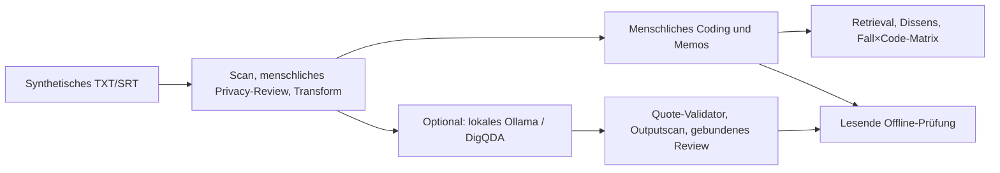

# AegisQDA — lokaler DH-Workbench

AegisQDA unterstützt qualitative Forschung in den Digital Humanities:
synthetische Interviews prüfen, belegnah codieren, Codebooks entwickeln,
reflexive Memos schreiben und mehrere Fälle vergleichend lesen. Eine lokale
Privacy-Pipeline geht jeder Forschung mit einem Run voraus. Optional liefert
der gepinnte DigQDA-Snapshot über lokales Ollama deskriptive Modellvorschläge.
Menschliche Interpretation und methodische Entscheidungen bleiben erforderlich.

**Stand: synthetischer Forschungsprototyp, terminalbasiert.** Realdatenpiloten
sind gesperrt. Eine Prozessfreigabe ist kein Beweis universeller Anonymität,
einer gültigen Interpretation oder einer institutionellen Freigabe.

## Was das Tool bietet

| Arbeitsschritt | Funktion |
|---|---|
| Quellen vorbereiten | UTF-8 TXT/SRT; de/fr/en; lokale Detektion, quellenfreie Planung überlappender Treffer, vollständiges Review, typisierte dokumentlokale Platzhalter, bestätigte grobe Generalisierung und zweiter Scan. |
| Forschungsansatz erklären | CODEBOOK, REFLEXIVE_THEMATIC oder GROUNDED_THEORY deklarieren. Die Deklaration dokumentiert den Ansatz; sie implementiert nicht automatisch dessen gesamte Methodologie. |
| Interpretieren und dokumentieren | Hierarchische versionierte Code-Definitionen, Codings auf exakten Contentspans und reflexive Memos. |
| Belege wiederfinden | Segment-IDs, Positionen und Hashes; interaktive wörtliche Suche; ausdrücklich angeforderte Evidenzansicht im geschützten Terminal. |
| Lesarten vergleichen | Unterschiedliche Codesets expliziter Analysten auf derselben Evidenz. Fehlende Codings gelten nicht automatisch als Dissens. |
| Fälle vergleichen | Geschützter Mehrfall-Workspace, Fall×Code-Matrix und deduplizierte Häufigkeiten. Gleiche Code-IDs benötigen identische Definitionen und Hierarchie; Methoden müssen kompatibel sein. |
| Modellunterstützung nutzen | Optionales OPEN_DESCRIPTIVE-Coding mit exakten Modell-/Contract-Hashes, Quote-Validator und Outputscan. Keine automatische Übernahme in das menschliche Codebook. |
| Bindungen prüfen | Quellenfreier Audit, lesender Offline-Verifier und Inventar lokaler Detektor-/Tokenizer-/Modellassets. Ein Asset-Hash ist keine Recall-Qualifikation. |

Häufigkeiten, Ko-Okkurrenzen und Dissens sind deskriptiv. Das Tool erzeugt keine
automatische Kausalitäts-, Validitäts- oder Intercoder-Reliabilitätsaussage.
Luxemburgisch (`lb`) bleibt ausdrücklich gesperrt.



## Lokale Einrichtung

```bash
cd AegisQDA
.venv/bin/aegisqda doctor
```

Für eine neue Umgebung ausschließlich einen freigegebenen lokalen Wheel-Cache
verwenden; `LOCAL_WHEELS` auf dessen tatsächlichen Pfad setzen:

```bash
python3 -m venv .venv
.venv/bin/python -m pip install --no-index --find-links "$LOCAL_WHEELS" -r requirements.lock
.venv/bin/python -m pip install --no-index --no-deps --no-build-isolation -e .
.venv/bin/aegisqda doctor
```

Installation ist keine Downloadfreigabe für Modelle. AegisQDA lädt spaCy- oder
Ollama-Modelle nicht automatisch herunter. Die bereits qualifizierten lokalen
Ollama-Paare sind `gemma3:4b` und `gemma4:e4b`; Tag **und** Digest müssen mit der
[Compatibility Evidence](docs/COMPATIBILITY_EVIDENCE.md) übereinstimmen.
Standard ist exakt `gemma3:4b`, ohne stillen Fallback.

## Ein synthetischer Forschungsfall

Die Commands werden schrittweise ausgeführt. `scan` endet absichtlich mit
Exitcode 3 / REVIEW_REQUIRED und nennt das neu erzeugte geschützte Runverzeichnis.

```bash
AEGIS=.venv/bin/aegisqda
$AEGIS scan tests/fixtures/en/safe.txt \
  --language en --case-id CASE-DEMO-001 --synthetic

# RUN auf das tatsächlich ausgegebene Verzeichnis setzen:
RUN=/private/tmp/aegisqda-runs/CASE-DEMO-001/run-...
$AEGIS review-plan "$RUN"
$AEGIS review "$RUN" --reviewer REVIEWER-001
$AEGIS transform "$RUN"

$AEGIS qda-init "$RUN" --analyst ANALYST-001 --method REFLEXIVE_THEMATIC
$AEGIS qda-codebook "$RUN" --analyst ANALYST-001 --code-id CODE-LEARNING-V1
# Label und Definition werden geschützt interaktiv abgefragt.

$AEGIS qda-segments "$RUN"
$AEGIS qda-search "$RUN"
# Suchtext wird interaktiv eingegeben; Ergebnisse enthalten keine Quellzitate.
$AEGIS qda-evidence "$RUN" --segment-id SEG-...

# START/END aus der geprüften Evidenz wählen; Ende exklusiv:
$AEGIS qda-code "$RUN" --analyst ANALYST-001 --code-id CODE-LEARNING-V1 \
  --start "$START" --end "$END"
$AEGIS qda-memo "$RUN" --analyst ANALYST-001 --code-id CODE-LEARNING-V1 \
  --start "$START" --end "$END"
$AEGIS qda-summary "$RUN"
$AEGIS qda-dissent "$RUN"
$AEGIS verify "$RUN"
```

Codings und Memos müssen vollständig innerhalb einer Contentzeile liegen.
SRT-Cuenummern und Zeitstempel sind keine Evidenz. Freitext wird interaktiv
abgefragt und bleibt im geschützten Run; Evidenzanzeige ist ebenfalls geschützt.
Die CLI begrenzt sehr lange Textanzeigen und macht Terminal-Steuerzeichen sichtbar.

## Mehrere Fälle vergleichen

```bash
WORKSPACE=/private/tmp/aegisqda-workspace-demo
$AEGIS qda-workspace-init "$WORKSPACE"
$AEGIS qda-workspace-add "$WORKSPACE" "$RUN" --case-id CASE-DEMO-001
# Einen zweiten freigegebenen Forschungsrun mit kompatiblen Codes hinzufügen:
$AEGIS qda-workspace-add "$WORKSPACE" "$RUN_2" --case-id CASE-DEMO-002
$AEGIS qda-matrix "$WORKSPACE"
```

Registrierungen sind an ihre konkrete Privacy-Freigabe und ihren bisherigen
Research-Verlauf gebunden. Änderungen, Umbenennungen oder widersprüchliche
Code-Definitionen dürfen nicht still in eine Vergleichsmatrix eingehen.
Die Matrix enthält opake IDs und Zählungen, keine Quellen, Labels oder Memos.
Der Workspace ist lokal und ungekeyt; vollständiges Umschreiben oder Entfernen
eines Log-Tails durch den Dateieigentümer ist ohne externen Head-Anker nicht
zuverlässig nachweisbar.

## Optionale Modellvorschläge

```bash
$AEGIS analyze "$RUN"
```

Vor dem Modellaufruf werden Freigabe und Transformation erneut rekonstruiert.
Freie Outputtreffer bleiben blockierend. Bei POST_SCAN_FINDINGS nennt die CLI
eine opake Attempt-ID; ausschließlich echte Detektorfehlalarme können einzeln
begründet und signiert geprüft werden:

```bash
$AEGIS keygen-review /private/tmp/aegisqda-reviewer/reviewer.pem
$AEGIS review-output "$RUN" --attempt-id "$ATTEMPT" --reviewer REVIEWER-001 \
  --signing-key /private/tmp/aegisqda-reviewer/reviewer.pem
$AEGIS finalize-output-review "$RUN" --attempt-id "$ATTEMPT"
$AEGIS verify "$RUN"
```

Identifizierende oder unsichere Ausgaben müssen blockiert bleiben. SELF_SIGNED_LOCAL
beweist lokale Schlüsselkontrolle; konfigurierte Fingerprints werden durchgesetzt.
Es ersetzt keinen institutionellen Trust Store. Ein akzeptierter technischer
Lauf bleibt DOWNSTREAM_REVIEW_REQUIRED und autorisiert keine Veröffentlichung.

## Lokale Grenzen und offene Ausbaupunkte

- Keine Cloud-Dienste, Remote-Inferenz, Telemetrie oder Remote-APIs im Tool.
- Ollama ausschließlich über literal Loopback, ohne Redirects, Proxy-/Auth-Erbe
  und ohne weitere Modellfreigaben.
- `vendor/digqda/` ist read-only und gegen `UPSTREAM.lock.json` geprüft.
- Geschützte Run- und Workspaceartefakte, Mappings, Schlüssel, Reviews und
  Ausgaben bleiben außerhalb Git und Cloud-Sync-Verzeichnissen, owner-only.
  Registrierte synthetische Repository-Fixtures sind die ausdrückliche Ausnahme.
  Bestehende externe Eingabequellen müssen separat geschützt werden; ihre
  ursprünglichen Dateirechte werden nicht automatisch geändert.
- Repository-Fixtures sind byte- und sprachgebunden. Externe synthetische
  Quellen bleiben eine ausdrücklich schwächere EXPLICIT_SYNTHETIC_ASSERTION.
- Signierter Trust Store, Rotation/Widerruf, unabhängige Vier-Augen-Freigabe,
  Infrastruktur-Attestation und institutionell freigegebene Detektormanifeste
  bleiben Pilot-Blocker. Die Inventarisierung ist ihr technischer Vorlauf:

```bash
$AEGIS detector-inventory --language en
$AEGIS audit "$RUN"
```

Weitere Forschungsfunktionen: allgemeine signierte Overlap-Auflösung über die
bereits vorhandene lesende Gruppenplanung hinaus,
methodische Einzelübernahme/Ablehnung von Modellvorschlägen, breitere Sprach-
und Entity-Qualifikation und eine lokale grafische Oberfläche. DigQDA strict/extend
bleibt geschlossen, bis Codebook, Forschungsfrage, Prompt und Grammar vollständig
gebunden sind.

## Prüfen und Änderungen committen

Lokaler Stand vom 2026-10-03: **618 Tests erfolgreich**, Ruff und Mypy sauber.
Zwei Transporttests benötigten Berechtigung für lokale Testports; alle übrigen
Prüfungen liefen in der eingeschränkten Sandbox. Details und Grenzen stehen im
[Reviewbericht](docs/GENERAL_REVIEW_WAVE1.md).

```bash
.venv/bin/python -m pytest -q
.venv/bin/python -m ruff check src scripts tests
.venv/bin/python -m mypy --check-untyped-defs src/aegisqda scripts/check_staged_privacy.py
.venv/bin/python scripts/synthetic_acceptance.py
.venv/bin/python scripts/verify_interviews.py

# Nach gezieltem git add, vor dem Commit:
.venv/bin/python scripts/check_staged_privacy.py
git diff --cached --check
git diff --cached --stat
```

`.githooks/pre-commit` ist vorbereitet, aber opt-in. Vorhandene globale Hooks
werden nicht überschrieben. Der Staged-Guard blockiert sensible Verzeichnisse,
Schlüssel, Runtimeartefakte und veränderten Upstream; er beweist nicht, dass
beliebiger Freitext synthetisch oder anonym ist.

Verwaiste Git-Sperren erst nach Prozessprüfung und nur bei sicherem Befund
entfernen. Der bereits angelegte Branch `codex/optimization-wave-1` kann danach
ab `git add` weiterverwendet werden.

Details: [DH-Arbeitsablauf](docs/DH_WORKBENCH.md),
[Review und Nachweise](docs/GENERAL_REVIEW_WAVE1.md),
[Generalisierungsregeln](docs/GENERALIZATION_RULES.md) und
[Governance-Vertrag](docs/GOVERNANCE_CONTRACT.md).
